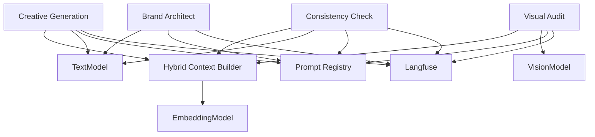
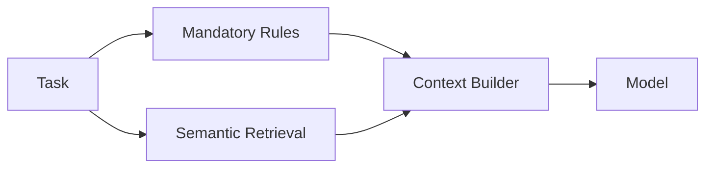

# AI System

## Objetivo

AI Platform desacopla dominio y proveedores. Los módulos consumen capacidades, no SDKs concretos.

## Capabilities



## Hybrid RAG

La recuperación combina:

### Mandatory Context
Reglas que siempre deben entrar:
- always rules;
- never rules;
- hard restrictions;
- reglas visuales obligatorias relevantes.

### Semantic Context
Top-k context según task:
- tone;
- audience;
- messaging;
- visual direction;
- composition.



## Task-specific retrieval

### Product Description / Video Script
- tone;
- audience;
- messaging;
- text rules;
- restrictions.

### Image Prompt
- visual personality;
- imagery;
- composition;
- logo usage;
- audience.

### Visual Audit
- mandatory visual rules;
- relevant visual guidelines;
- primary/alternate logo;
- visual references.

## Fail-safe

Si Brand Knowledge obligatorio no está disponible, no generar contenido genérico.

## Structured Outputs

Todos los outputs importantes pasan por Pydantic.

### BrandDNAOutput
```text
brand_core
audience
tone_of_voice
messaging
rules
visual_guidelines
```

### CreativeOutput
```text
content_type
title
content / structured_sections
applied_rule_ids[]
```

### ConsistencyResult
```text
checks[]
findings[]
summary
```

### VisualAuditResult
```text
checks[]
findings[]
summary
```

Finding:
```text
rule_id
category
severity
status
expected
detected
evidence
recommendation
```

## Scoring

El modelo clasifica findings. El backend calcula score.

No existe threshold automático de aprobación.

## Prompt Registry

Prompts versionados:

```text
brand.architect.v1
creative.product_description.v1
creative.video_script.v1
creative.image_prompt.v1
consistency.text.v1
audit.visual.v1
```

Registrar `prompt_version` en Langfuse.

## Provider Interfaces

```text
TextModel
  generate()
  generate_structured()

VisionModel
  analyze_structured()

EmbeddingModel
  embed()
```

No importar SDKs de providers fuera de `ai/providers/`.
