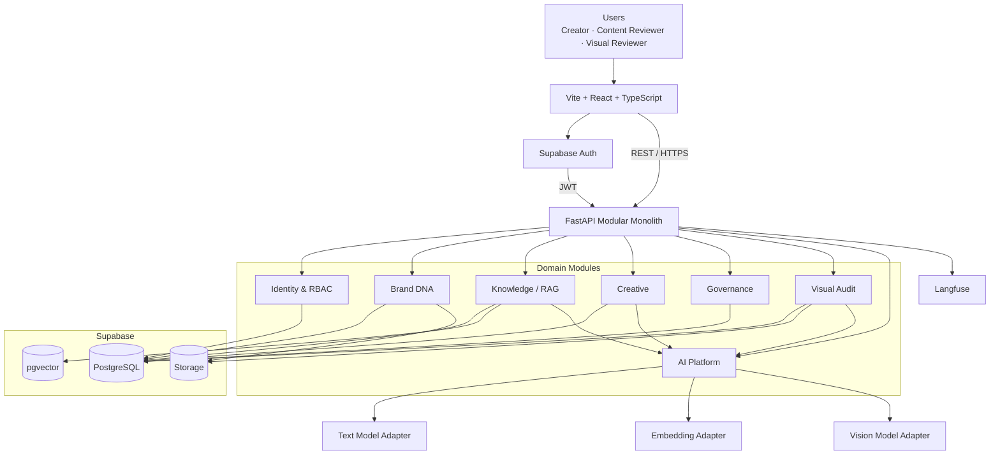
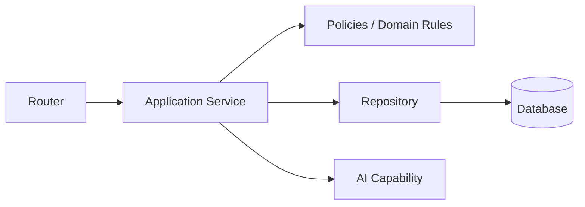

# Architecture

## Decisión principal

Content Suite será un **monorepo estructurado con Turborepo** y un **modular monolith** en el backend.

Turborepo orquesta las tareas compartidas del repositorio. Una única API FastAPI concentra la autoridad de dominio, RBAC, workflows, RAG y AI orchestration. Los módulos están separados por dominio, no por procesos desplegables.

## Macro Architecture



## Frontend

Vite + React se elige porque FastAPI es la única capa backend de negocio. No necesitamos SSR ni server actions para este reto.

Responsabilidades frontend:
- routing;
- forms;
- role-aware rendering;
- server state;
- optimistic UX solo donde sea seguro;
- visualización de estados y errores.

No debe contener:
- reglas de autorización;
- state machine de dominio como autoridad;
- provider API keys;
- prompts productivos.

## Backend

Patrón por módulo:



## Estructura física objetivo

```text
/
├── apps/
│   ├── web/                 # workspace npm: Vite + React
│   └── api/                 # proyecto Python gestionado con uv
│       ├── pyproject.toml
│       └── uv.lock
├── package.json             # scripts raíz y Turbo
├── turbo.json               # orquestación de tareas
├── docs/
├── openspec/
│   ├── specs/              # contratos de capacidades ya aceptados
│   ├── changes/            # changes activas y sus deltas
│   └── config.yaml
├── README.md
├── PROJECT_CONTEXT.md
├── ARCHITECTURE.md
├── AI_SYSTEM.md
├── AGENTS.md
├── MODULES.md
├── DATA_MODEL.md
├── API.md
├── WORKFLOWS.md
└── starter-design/          # referencia visual, no aplicación desplegable
```

## Toolchain

- Turborepo coordina `dev`, `lint`, `typecheck`, `test` y `build` desde la raíz; no sustituye el gestor de dependencias de cada app.
- `apps/web` usa npm workspaces para dependencias JavaScript.
- `apps/api` usa `uv`, `pyproject.toml` y `uv.lock` para dependencias, entornos y comandos Python.
- Antes de instalar o actualizar una librería, el agente consulta Context7 para validar la documentación y la versión estable actual compatible; si no existe una entrada exacta, usa la documentación oficial y el registry.
- OpenSpec es el flujo de cambios: `openspec/specs/` almacena contratos aceptados y `openspec/changes/` los cambios activos con proposal, specs, design y tasks.

## Reglas de dependencias

- `identity` no depende de módulos de negocio.
- `brand_dna` puede disparar `knowledge`.
- `creative` consume `knowledge` y `ai`.
- `governance` consume versiones de `creative`.
- `visual_audit` consume `governance`, `knowledge`, `storage` y `ai`.
- `ai` no debe conocer estados de workflow.
- providers externos no deben importarse directamente desde routers o servicios de dominio.

## Async

FastAPI usa async para I/O:
- DB;
- storage;
- provider calls;
- Langfuse.

No introducir workers o queue hasta que exista una razón medible.

## Decisiones relacionadas

Ver:
- `docs/adr/001-modular-monolith.md`
- `docs/adr/002-database-choice.md`
- `docs/adr/003-auth-strategy.md`
- `docs/adr/004-hybrid-rag.md`
- `docs/adr/005-ai-provider-abstraction.md`
