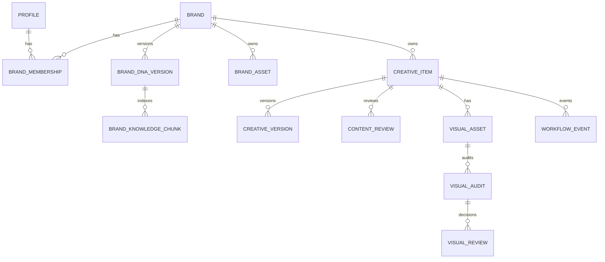

# Data Model

## Entidades



## Tables

### profiles
```text
id uuid PK
email text unique
display_name text
created_at timestamptz
```

### brands
```text
id uuid PK
name text
slug text unique
created_at timestamptz
```

### brand_memberships
```text
id uuid PK
profile_id uuid FK
brand_id uuid FK
role enum(CREATOR, CONTENT_REVIEWER, VISUAL_REVIEWER)
created_at timestamptz

UNIQUE(profile_id, brand_id)
```

### brand_dna_versions
```text
id uuid PK
brand_id uuid FK
version int
status enum(DRAFT, ACTIVE, ARCHIVED)
document jsonb
created_by uuid FK
created_at timestamptz
published_at timestamptz null
knowledge_status enum(NOT_SYNCED, SYNCING, SYNCED, OUTDATED, FAILED)

UNIQUE(brand_id, version)
```

### brand_knowledge_chunks
```text
id uuid PK
brand_dna_version_id uuid FK
section text
rule_type text
scope enum(TEXT, VISUAL, BOTH)
mandatory boolean
content text
metadata jsonb
embedding vector
created_at timestamptz
```

### brand_assets
```text
id uuid PK
brand_id uuid FK
brand_dna_version_id uuid FK nullable
type enum(PRIMARY_LOGO, ALT_LOGO, VISUAL_REFERENCE)
storage_path text
metadata jsonb
created_at timestamptz
```

### creative_items
```text
id uuid PK
brand_id uuid FK
type enum(PRODUCT_DESCRIPTION, VIDEO_SCRIPT, IMAGE_PROMPT)
title text
workflow_status enum
created_by uuid FK
created_at timestamptz
updated_at timestamptz
```

### creative_versions
```text
id uuid PK
creative_item_id uuid FK
version int
brand_dna_version_id uuid FK
origin enum(AI_GENERATED, AI_REGENERATED, HUMAN_EDIT)
brief jsonb
output jsonb
applied_rule_ids uuid[]
consistency_result jsonb nullable
consistency_score numeric nullable
langfuse_trace_id text nullable
created_by uuid FK
created_at timestamptz

UNIQUE(creative_item_id, version)
```

### content_reviews
```text
id uuid PK
creative_item_id uuid FK
submitted_version_id uuid FK
reviewer_id uuid FK
decision enum(APPROVED, CHANGES_REQUESTED)
feedback text nullable
created_at timestamptz
```

### visual_assets
```text
id uuid PK
creative_item_id uuid FK
version int
storage_path text
metadata jsonb
uploaded_by uuid FK
created_at timestamptz

UNIQUE(creative_item_id, version)
```

### visual_audits
```text
id uuid PK
visual_asset_id uuid FK
brand_dna_version_id uuid FK
checks jsonb
findings jsonb
score numeric
summary text
langfuse_trace_id text nullable
created_at timestamptz
```

### visual_reviews
```text
id uuid PK
visual_audit_id uuid FK
reviewer_id uuid FK
decision enum(APPROVED, CHANGES_REQUESTED)
feedback text nullable
exception_accepted boolean default false
created_at timestamptz
```

### workflow_events
```text
id uuid PK
creative_item_id uuid FK
event_type text
actor_id uuid FK nullable
metadata jsonb
created_at timestamptz
```

## Principios

- `BrandDNAVersion.document` es canónico.
- chunks son derivados.
- reviews referencian versiones exactas.
- audits referencian visuales exactos.
- no sobrescribir versiones publicadas o revisadas.
- workflow history es append-only a nivel de aplicación.
