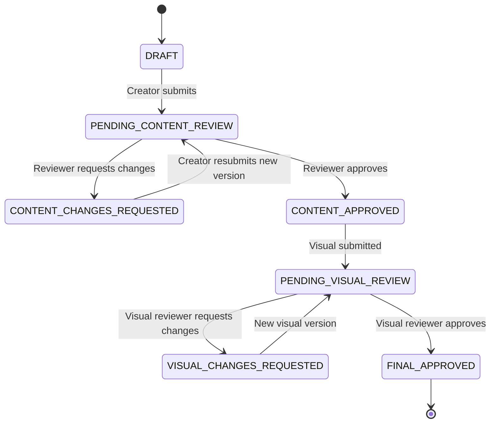
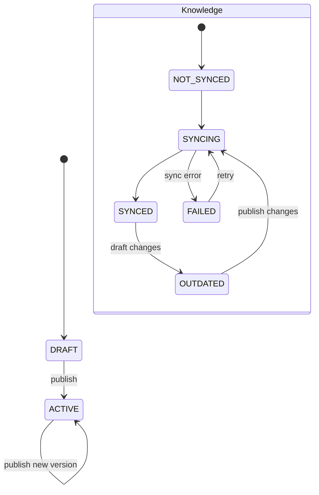

# Workflows

## Main Workflow



## Brand DNA lifecycle



## Content submission

1. Creator selecciona una `creative_version`.
2. Backend verifica:
   - role = CREATOR;
   - version pertenece al item;
   - Brand Knowledge requerido disponible;
   - estado permite submit.
3. `creative_item.workflow_status = PENDING_CONTENT_REVIEW`.
4. Se registra `workflow_event`.
5. La versión enviada queda congelada.

## Request Changes

No se modifica la versión rechazada.

```text
v3 submitted
 -> Changes Requested
 -> creator edits
 -> v4 created
 -> v4 submitted
```

## Content Approval

Aprobación semántica no significa aprobación visual.

```text
CONTENT_APPROVED
  -> visual asset version
  -> multimodal audit
  -> human visual decision
```

## Visual exception

Si existe un finding HIGH, el reviewer puede aprobar de todas formas.

Debe quedar:
- finding;
- decision;
- `exception_accepted = true`;
- actor;
- timestamp.

## Guards

Transitions inválidas se rechazan en backend.

Ejemplos:
- Creator intenta aprobar -> 403.
- Reviewer intenta editar -> 403.
- Approve desde `DRAFT` -> 409.
- Submit v3 y modificar v3 -> no permitido; crear v4.
