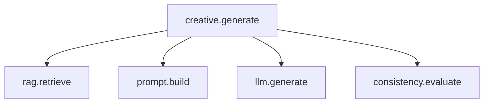
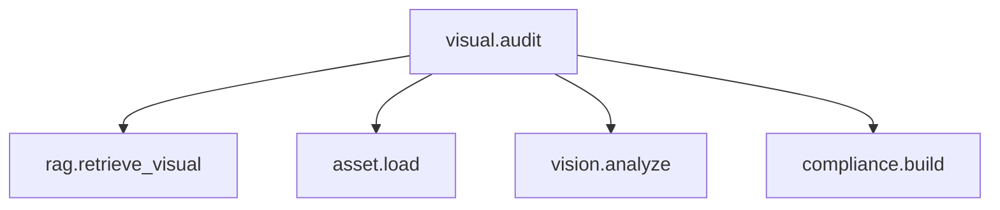

# Observability

## Principle

La UI de Observability es opcional para etapas tempranas. El tracing no.

## Langfuse traces

### Creative



### Visual Audit



## Trace metadata

```text
brand_id
brand_dna_version_id
creative_item_id?
creative_version_id?
visual_asset_id?
user_id
role
model
prompt_version
retrieved_rule_ids
latency_ms
status
```

## Domain links

Persistir `langfuse_trace_id` en:
- AI-generated creative versions;
- visual audits;
- otras entidades donde ayude a reproducibilidad.

## Metrics útiles

MVP:
- provider latency;
- failures;
- retrieval count;
- audit duration.

No construir dashboards de infraestructura innecesarios.
